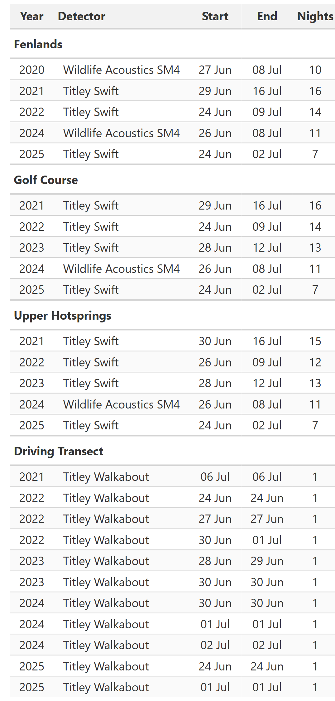
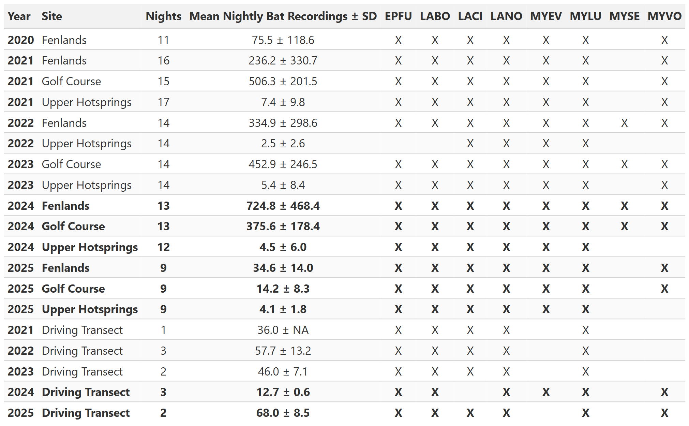
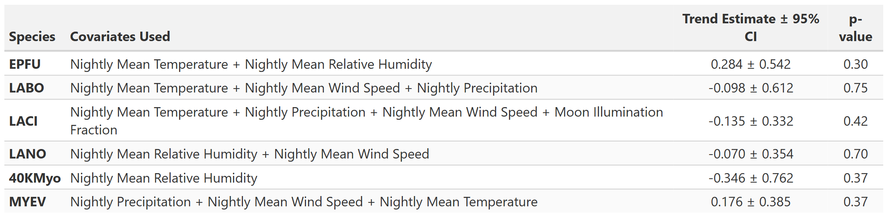

```{r}
#| label: reference -species trend models
#| include: false
#| echo: false
#| eval: true
#| warning: false
#| message: false
# 
# #This is for reference only. The report does not use this code to create anything. This is the code used to create and select the best fit model. If need can uncomment the whole section and run code.
# 
# suppressPackageStartupMessages({
#   library(tidyverse)
#   library(janitor)
#   library(glmmTMB)
#   library(MuMIn)
#   library(DHARMa)
#   library(broom.mixed)
#   library(patchwork)
# })
# 
# # ------------------------- GLOBAL SETTINGS ---------------------------
# YEARS_TO_USE <- c(2020, 2021,2022, 2023, 2024, 2025)
# 
# 
# species_vec  <- c("EPFU", "LABO", "LACI", "LANO", "40KMyo", "MYEV") #MYEV not inlcuded because of low counts
# 
# # Candidate covariates (raw names in the file)
# cand_raw <- c("eccc_mean_temp", "eccc_mean_rh", "eccc_precip",
#               "eccc_wind_speed", "mphase", "mtime2h", "mtime2h_mphase")
# 
# MAX_COVARS  <- 5
# DELTA_KEEP  <- 2
# HIGH_WT     <- 0.80
# MOD_WT      <- 0.50
# forbid_pair <- c("z_mtime2h", "z_mtime2h_mphase")
# COR_CUTOFF  <- 0.70
# 
# ctrl_nlminb <- glmmTMBControl(optCtrl = list(iter.max = 20000, eval.max = 20000))
# ctrl_bfgs   <- glmmTMBControl(optimizer = optim,
#                               optArgs   = list(method = "BFGS",
#                                                control = list(maxit = 20000)))
# #when run this code LANO best fit family is ZINB, but by a marginal difference in AIC. For consistency and to easily compare across spp models will force to use NB2 since all other species used it
# FORCE_FAMILY <- c(LABO = "NB2", '40KMyo' = "NB2" )
# # ----------------------------- HELPERS -------------------------------
# scale_with_na <- function(x) {
#   x <- as.numeric(x)
#   m <- mean(x, na.rm = TRUE); s <- sd(x, na.rm = TRUE)
#   if (!is.finite(m) || !is.finite(s) || s == 0) return(rep(0, length(x)))
#   (x - m) / s
# }
# 
# make_subsets <- function(vars, kmax) {
#   out <- list(character(0))
#   for (k in 1:min(kmax, length(vars))) out <- c(out, combn(vars, k, simplify = FALSE))
#   out
# }
# 
# ok_subset <- function(ss) !all(forbid_pair %in% ss)
# 
# AICc_safe <- function(mod) {
#   if (is.null(mod)) return(NA_real_)
#   a <- tryCatch(MuMIn::AICc(mod), error = function(e) NA_real_)
#   if (!is.finite(a)) NA_real_ else a
# }
# 
# fit_try_glmmTMB <- function(fml, data, family, ziformula = ~0) {
#   fit_once <- function(ctrl) {
#     tryCatch(
#       glmmTMB(fml, data = data, family = family, ziformula = ziformula,
#               dispformula = ~1, REML = FALSE, control = ctrl),
#       error = function(e) e
#     )
#   }
#   m1 <- fit_once(ctrl_nlminb)
#   if (!inherits(m1, "error")) return(list(mod = m1, ctrl = "nlminb", err = NA_character_))
#   m2 <- fit_once(ctrl_bfgs)
#   if (!inherits(m2, "error")) return(list(mod = m2, ctrl = "BFGS", err = NA_character_))
#   list(mod = NULL, ctrl = NA_character_,
#        err = paste("nlminb:", m1$message, "| BFGS:", m2$message))
# }
# 
# strip_cond <- function(x) gsub("\\)$", "", gsub("^cond\\(", "", x))
# 
# drop_collinear <- function(df, vars, cutoff = 0.7) {
#   vars <- vars[vars %in% names(df)]
#   if (length(vars) <= 1) return(vars)
#   repeat {
#     cc <- suppressWarnings(cor(df[, vars, drop = FALSE], use = "pairwise.complete.obs"))
#     cc[is.na(cc)] <- 0; diag(cc) <- 0
#     mx <- max(abs(cc))
#     if (!is.finite(mx) || mx < cutoff) break
#     idx <- which(abs(cc) == mx, arr.ind = TRUE)[1, ]
#     v1 <- vars[idx[1]]; v2 <- vars[idx[2]]
#     mean_abs <- colMeans(abs(cc))
#     drop_v <- if (mean_abs[v1] >= mean_abs[v2]) v1 else v2
#     vars <- setdiff(vars, drop_v)
#   }
#   vars
# }
# 
# # --------------------- READ DATA ONCE (not per species) --------------
# dat_raw <- read.csv("Data/NABat_Banff2020-2025-detectorClean.csv")
# dat_raw <- dat_raw %>%
#   mutate(
#     date    = as.Date(date),
#     year    = as.integer(year),
#     species = as.character(species),
#     site    = factor(x_location_name)
#   )
# #remove the driving transects from stationary deployment models
# dat_raw <- dat_raw[dat_raw$x_location_name !="DrivingTransect",]
# 
# # ---- Collapse the 40 kHz Myotis complex into one code, summing counts ----
# myo_codes <- c("MYVO", "MYLU", "MYSE", "40KMYO")
# 
# dat_raw  <- dat_raw %>%
#   mutate(species = if_else(species %in% myo_codes, "40KMyo", species)) %>%
#   group_by(species, year, date, x_location_name) %>%
#   summarise(
#     n_files   = sum(n_files,   na.rm = TRUE),   # combine detections across the 4 spp
#     sec_total = sum(sec_total, na.rm = TRUE),   # combine effort (per-species here)
#     across(-c(n_files, sec_total), first),      # covariates are night-level & identical
#     .groups = "drop"
#   )
# 
# cand_raw <- intersect(cand_raw, names(dat_raw))   # keep only covariates present
# 
# # =====================================================================
# ## PER-SPECIES WORKER
# ## Returns ok = TRUE only if a final support model converged.
# ## Any stop()/error inside is caught -> ok = FALSE with a reason,
# ## so one problem species never kills the whole loop.
# # =====================================================================
# run_species <- function(SP, data_all) {
# 
#   fail <- function(reason)
#     list(sp = SP, ok = FALSE, reason = reason,
#          report_tbl = tibble(), meta_tbl = tibble(), diag_tbl = tibble(),
#          support_vars = character(0),
#          plot = ggplot() + theme_void() +
#            labs(title = paste0(SP, " (", reason, ")")))
# 
#   tryCatch({
# 
#     # 0) filter + YearS + z-scale
#     dat0 <- data_all %>%
#       filter(year %in% YEARS_TO_USE, species == SP) %>%
#       mutate(YearS    = year - min(YEARS_TO_USE),
#              det_unit = factor(det_unit))
# 
#     cand_use <- intersect(cand_raw, names(dat0))
#     if (length(cand_use) == 0) return(fail("no candidate covariates in data"))
#     for (v in cand_use) dat0[[paste0("z_", v)]] <- scale_with_na(dat0[[v]])
#     zcand_all <- paste0("z_", cand_use)
# 
#     needed <- c("n_files", "YearS", "site", "det_unit", zcand_all)
#     df_use <- dat0 %>% drop_na(any_of(needed)) %>% droplevels()
# 
#     if (nrow(df_use) < 30 || n_distinct(df_use$year) < 2)
#       return(fail("insufficient data after NA filtering"))
# 
#     zero_prop <- mean(df_use$n_files == 0, na.rm = TRUE)
# 
#     # A) collinearity screen
#     zcand_keep <- drop_collinear(df_use, zcand_all, cutoff = COR_CUTOFF)
#     if (all(forbid_pair %in% zcand_keep)) {
#       cc <- suppressWarnings(cor(df_use[, zcand_keep, drop = FALSE],
#                                  use = "pairwise.complete.obs"))
#       cc[is.na(cc)] <- 0; diag(cc) <- 0
#       mean_abs <- colMeans(abs(cc))
#       zcand_keep <- setdiff(zcand_keep,
#                             forbid_pair[which.max(mean_abs[forbid_pair])])
#     }
#     if (length(zcand_keep) == 0) return(fail("collinearity screen removed all covariates"))
# 
#     # 1) selection over NB2 subsets
#     subsets <- make_subsets(zcand_keep, MAX_COVARS)
#     subsets <- subsets[vapply(subsets, ok_subset, logical(1))]
# 
#     model_list <- list(); rhs_vec <- character(0)
#     aicc_vec <- numeric(0); ctrl_used <- character(0)
#     fail_log <- tibble(covars = character(0), error = character(0))
# 
#     for (ss in subsets) {
#       rhs <- c("YearS","det_unit", ss, "(1|site:year)") #need to account for the differences in detectors over the years as well as site differences
#       fml <- as.formula(paste("n_files ~", paste(rhs, collapse = " + ")))
#       fit <- fit_try_glmmTMB(fml, df_use, family = nbinom2(link = "log"), ziformula = ~0)
#       if (is.null(fit$mod)) {
#         fail_log <- add_row(fail_log, covars = paste(ss, collapse = " + "), error = fit$err); next
#       }
#       a <- AICc_safe(fit$mod)
#       if (!is.na(a)) {
#         model_list[[length(model_list) + 1]] <- fit$mod
#         aicc_vec  <- c(aicc_vec, a)
#         rhs_vec   <- c(rhs_vec, paste(ss, collapse = " + "))
#         ctrl_used <- c(ctrl_used, fit$ctrl)
#       } else {
#         fail_log <- add_row(fail_log, covars = paste(ss, collapse = " + "), error = "AICc NA")
#       }
#     }
#     if (length(model_list) == 0) return(fail("no NB2 selection models converged"))
# 
#     sel_tbl <- tibble(model_id = seq_along(model_list), covars = rhs_vec,
#                       ctrl = ctrl_used, AICc = aicc_vec) %>%
#       arrange(AICc) %>%
#       mutate(delta = AICc - min(AICc),
#              weight = exp(-0.5 * delta) / sum(exp(-0.5 * delta)))
# 
#     keep_delta <- DELTA_KEEP
#     top_ids <- sel_tbl %>% filter(delta <= keep_delta) %>% pull(model_id)
#     if (length(top_ids) < 2) {
#       keep_delta <- 4
#       top_ids <- sel_tbl %>% filter(delta <= keep_delta) %>% pull(model_id)
#     }
#     topmods <- model_list[top_ids]
#     avg <- if (length(topmods) >= 2) MuMIn::model.avg(topmods) else NULL
# 
#     # 2) support variables from importance weights
#     if (!is.null(avg)) {
#       support_source <- as.data.frame(MuMIn::sw(avg)) %>%
#         rownames_to_column("term") %>% rename(sumw = 2) %>%
#         mutate(term = strip_cond(term)) %>%
#         filter(term %in% c("YearS", zcand_keep)) %>% arrange(desc(sumw))
#     } else {
#       support_source <- tibble(term = zcand_keep, sumw = 0)
#       for (i in seq_len(nrow(sel_tbl))) {
#         ss <- trimws(unlist(strsplit(sel_tbl$covars[i], "\\+"))); ss <- ss[ss != ""]
#         support_source$sumw[support_source$term %in% ss] <-
#           support_source$sumw[support_source$term %in% ss] + sel_tbl$weight[i]
#       }
#       support_source <- support_source %>% arrange(desc(sumw))
#     }
# 
#     high_vars <- support_source %>% filter(term != "YearS", sumw >= HIGH_WT) %>% pull(term)
#     mod_vars  <- support_source %>% filter(term != "YearS", sumw >= MOD_WT)  %>% pull(term)
#     support_vars <- mod_vars
#     if (length(support_vars) == 0)
#       support_vars <- if (length(high_vars) > 0) high_vars
#     else support_source$term[support_source$term != "YearS"][1]
#     if (all(forbid_pair %in% support_vars)) {
#       pair_tbl <- support_source %>% filter(term %in% forbid_pair)
#       support_vars <- setdiff(support_vars, pair_tbl$term[which.min(pair_tbl$sumw)])
#     }
#     support_vars <- support_vars[!is.na(support_vars)]
# 
#     # 3) fit support model across 4 families, pick best by AICc
#     f_support <- as.formula(
#       paste("n_files ~ YearS + det_unit +", paste(support_vars, collapse = " + "), " + (1|site:year)"))
# 
#     fit_support_family <- function(fam_name) {
#       spec <- switch(fam_name,
#                      NB2   = list(fam = nbinom2(link = "log"), zi = ~0),
#                      NB1   = list(fam = nbinom1(link = "log"), zi = ~0),
#                      ZINB2 = list(fam = nbinom2(link = "log"), zi = ~1),
#                      ZINB1 = list(fam = nbinom1(link = "log"), zi = ~1))
#       fit <- fit_try_glmmTMB(f_support, df_use, family = spec$fam, ziformula = spec$zi)
#       if (is.null(fit$mod))
#         return(list(mod = NULL, fam = fam_name, ctrl = NA_character_,
#                     AICc = NA_real_, dispersion_p = NA_real_, zero_infl_p = NA_real_))
#       sim    <- tryCatch(DHARMa::simulateResiduals(fit$mod, n = 500), error = function(e) NULL)
#       disp_p <- if (!is.null(sim)) tryCatch(DHARMa::testDispersion(sim)$p.value, error = function(e) NA_real_) else NA_real_
#       zi_p   <- if (!is.null(sim)) tryCatch(DHARMa::testZeroInflation(sim)$p.value, error = function(e) NA_real_) else NA_real_
#       list(mod = fit$mod, fam = fam_name, ctrl = fit$ctrl, AICc = AICc_safe(fit$mod),
#            dispersion_p = disp_p, zero_infl_p = zi_p)
#     }
# 
#     fits <- lapply(c("NB2", "NB1", "ZINB2", "ZINB1"), fit_support_family)
#     names(fits) <- c("NB2", "NB1", "ZINB2", "ZINB1")
#     fit_ok <- fits[!vapply(fits, function(x) is.null(x$mod), logical(1))]
#     if (length(fit_ok) == 0) return(fail("no support-family model converged"))
# 
#     diag_tbl <- tibble(
#       family       = names(fit_ok),
#       AICc         = vapply(fit_ok, function(x) x$AICc, numeric(1)),
#       dispersion_p = vapply(fit_ok, function(x) x$dispersion_p, numeric(1)),
#       zero_infl_p  = vapply(fit_ok, function(x) x$zero_infl_p, numeric(1))
#     ) %>% arrange(AICc)
# 
#     best_family <- diag_tbl$family[1]
#     if (SP %in% names(FORCE_FAMILY) && FORCE_FAMILY[[SP]] %in% diag_tbl$family) {
#       best_family <- FORCE_FAMILY[[SP]]     # override the AICc pick
#     }
#     best_row    <- which(diag_tbl$family == best_family)[1]
#     final_model <- fit_ok[[best_family]]$mod
# 
#     # 4) fixed-effects + IRR table
#     report_tbl <- broom.mixed::tidy(final_model, effects = "fixed", conf.int = TRUE) %>%
#       mutate(sp = SP, family = best_family,
#              IRR = exp(estimate), IRR_low = exp(conf.low), IRR_high = exp(conf.high)) %>%
#       select(sp, family, term, estimate, std.error, conf.low, conf.high,
#              statistic, p.value, IRR, IRR_low, IRR_high)
# 
#     re_sd <- broom.mixed::tidy(final_model, effects = "ran_pars") %>%
#       filter(group == "site:year", term == "sd__(Intercept)") %>% pull(estimate)
#     re_sd <- if (length(re_sd) == 0) NA_real_ else re_sd[1]
# 
#     meta_tbl <- tibble(
#       sp          = SP,
#       best_family = best_family,
#       optimizer   = fit_ok[[best_family]]$ctrl,
#       formula     = paste(deparse(f_support), collapse = ""),
#       n_obs       = nobs(final_model),
#       n_sites     = nlevels(df_use$site),
#       n_years     = n_distinct(df_use$year),
#       zero_prop   = zero_prop,
#       site_re_sd  = re_sd,
#       theta       = sigma(final_model),
#       AIC         = AIC(final_model),
#       AICc_best    = diag_tbl$AICc[best_row],
#       dispersion_p = diag_tbl$dispersion_p[best_row],
#       zero_infl_p  = diag_tbl$zero_infl_p[best_row]
#     )
# 
#     # 5) trend plot (log y-axis + observed yearly means overlaid)
#     year_seq  <- seq(min(df_use$YearS), max(df_use$YearS), length.out = 200)
#     pred_grid <- tibble(YearS = year_seq)
#     for (v in support_vars) pred_grid[[v]] <- 0
#     pred_grid$site      <- df_use$site[1]
#     pred_grid$year      <- df_use$year[1]   # real level so site:year exists; re.form = NA zeroes it
#     pred_grid$det_unit  <- factor("Swift", levels = levels(df_use$det_unit))
#     pred_grid$year_plot <- min(df_use$year) + year_seq
# 
#     pr <- predict(final_model, newdata = pred_grid, type = "link",
#                   se.fit = TRUE, re.form = NA)
#     pred_trend <- pred_grid %>%
#       mutate(fit = exp(pr$fit),
#              lo  = exp(pr$fit - 1.96 * pr$se.fit),
#              hi  = exp(pr$fit + 1.96 * pr$se.fit))
# 
#     obs_year <- df_use %>% group_by(year) %>%
#       summarise(mean_files = mean(n_files), .groups = "drop") %>%
#       filter(mean_files > 0)   # log axis can't show 0
# 
#     # dash the trend line when YearS is highly significant (p < 0.001)
#     yearS_p   <- report_tbl$p.value[report_tbl$term == "YearS"][1]
#     line_type <- if (!is.na(yearS_p) && yearS_p < 0.05) "solid" else "dashed"
# 
#     p <- ggplot(pred_trend, aes(year_plot, fit)) +
#       geom_ribbon(aes(ymin = lo, ymax = hi), alpha = 0.25) +
#       geom_line(linewidth = 1, linetype = line_type) +
#       labs(title = SP, x = "Year", y = "Predicted detections per night") +
#       theme_classic()
# 
#     list(sp = SP, ok = TRUE, reason = NA_character_,
#          report_tbl = report_tbl, meta_tbl = meta_tbl, diag_tbl = diag_tbl,
#          support_vars = support_vars, plot = p)
# 
#   }, error = function(e) fail(conditionMessage(e)))
# }
# 
# # =====================================================================
# ## RUN THE LOOP
# # =====================================================================
# results <- lapply(species_vec, run_species, data_all = dat_raw)
# names(results) <- species_vec
# 
# ok_flags <- vapply(results, function(x) isTRUE(x$ok), logical(1))
# message("Converged: ", paste(species_vec[ok_flags], collapse = ", "),
#         " | Failed: ", paste(species_vec[!ok_flags], collapse = ", "))
# 
# # ---------------------------------------------------------------------
# ## (1) MODEL SUMMARY — one row per species that CONVERGED
# ##     meta stats + the headline YearS (trend) effect
# # ---------------------------------------------------------------------
# models_summary <- bind_rows(lapply(results[ok_flags], function(x) {
#   yr <- x$report_tbl %>% filter(term == "YearS")
#   x$meta_tbl %>%
#     mutate(
#       YearS_estimate = yr$estimate[1],
#       YearS_se       = yr$std.error[1],
#       YearS_p        = yr$p.value[1],
#       YearS_IRR      = yr$IRR[1],
#       YearS_IRR_low  = yr$IRR_low[1],
#       YearS_IRR_high = yr$IRR_high[1]
#     )
# }))
# 
# # species that did NOT converge, with the reason
# models_failed <- tibble(
#   sp     = species_vec[!ok_flags],
#   reason = vapply(results[!ok_flags],
#                   function(x) if (is.null(x$reason)) "unknown" else x$reason,
#                   character(1))
# )
# 
# # ---------------------------------------------------------------------
# ## (2) COVARIATES USED — which covariates each converged model kept
# ##     (YearS + (1|site:year) are in every model, so not listed here)
# # ---------------------------------------------------------------------
# 
# # readable labels for covariates (raw model name -> display name)
# cov_labels <- c(
#   eccc_mean_temp  = "Nightly Mean Temperature",
#   eccc_wind_speed = "Nightly Mean Wind Speed",
#   mtime2h         = "Moon Above Horizon at Midnight (binary)",
#   eccc_mean_rh    = "Nightly Mean Relative Humidity",
#   eccc_precip     = "Nightly Precipitation",
#   mphase          = "Moon Illumination Fraction",
#   mtime2h_mphase = "Moon Above Horizon \u00d7 Illumination"
# )
# 
# 
# covariates_used <- tibble(
#   sp = species_vec[ok_flags],
#   covariates = vapply(results[ok_flags], function(x) {
#     v <- sub("^z_", "", x$support_vars)          # drop the z_ prefix
#     v <- ifelse(v %in% names(cov_labels), cov_labels[v], v)  # apply readable labels
#     if (length(v) == 0) NA_character_ else paste(v, collapse = " + ")
#   }, character(1))
# )
# 
# 
# # full fixed-effects / IRR table across all converged species (optional but handy)
# all_report <- bind_rows(lapply(results[ok_flags], `[[`, "report_tbl"))
# 
# ## WRITE OUTPUTS
# # ---------------------------------------------------------------------
# dir.create("Data", recursive = TRUE, showWarnings = FALSE)
# write_csv(models_summary,       "Data/bat_trends_models_summary.csv")
# write_csv(covariates_used,      "Data/bat_trends_covariates_used.csv")
# write_csv(models_failed,        "Data/bat_trends_models_failed.csv")
# write_csv(all_report,           "Data/bat_trends_fixed_effects_IRR_all_species.csv")
# 
# 
# ## MULTIPANEL PLOT (converged species)
# # ---------------------------------------------------------------------
# plot_list <- lapply(results[ok_flags], `[[`, "plot")
# if (length(plot_list) > 0) {
#   multi <- patchwork::wrap_plots(plot_list, ncol = 3)
#   ggsave("Figures/Trends/bat_trends_multipanel.png", multi, width = 12, height = 8, dpi = 300)
#   ggsave("Figures/Trends/bat_trends_multipanel.pdf", multi, width = 12, height = 8)
# }
```

```{r}
#| label: Load packages and summary data
#| include: false
#| echo: false
#| eval: true
#| warning: false
#| message: false
 
library(dplyr)
library(tidyr)
library(readr)
library(gt)
library(leaflet)
library(htmltools)
library(base64enc)
library(flextable)
library(kableExtra)
library(knitr)
library(ggplot2)
library(htmltools)
library(sf)
#set these so that the document can render both html and pdf
is_html <- knitr::pandoc_to("html")
is_pdf  <- !is_html

#Need to specify figure captions based on the rendering type (PDF or HTML)
cap_sitesummary <- paste0(
  "Acoustic bat monitoring sites in Banff. ",
  "Stationary recording stations are shown as blue circular markers and ",
  "driving transect is in red line. The boundary of the grid cell is shown in dashed grey line.",
  if (is_html) paste0(
    " Clicking any site opens a summary of species detections, including a ",
    "table of total detections by species code and a bar chart of means of daily ",
    "detection totals."
  ) else ""
)

#load summary and trend model data
df <- read.csv("Data/NABat_Banff2020-2025-detector.csv")
sites <- read.csv("Data/BNP_Meta2020-2025.csv")

models_summary <- read_csv("Data/bat_trends_models_summary.csv")
covariates_used<- read_csv("Data/bat_trends_covariates_used.csv")

#---Update site names-----------------------------------------------------------

sites <- sites |>
  mutate(Location.Name = case_when(
    Location.Name == "148842_NW_01" ~ "Fenlands",
    Location.Name == "148842_NE_01" ~ "Golf Course",
    Location.Name == "148842_SW_01" ~ "Upper Hotsprings",
    Location.Name == "DrivingTransect" ~ "Driving Transect",
    TRUE ~ Location.Name   # keeps any unmapped values as-is
  ))

df<- df |>
  mutate(Site = case_when(
    x_location_name == "148842_NW_01" ~ "Fenlands",
    x_location_name == "148842_NE_01" ~ "Golf Course",
    x_location_name == "148842_SW_01" ~ "Upper Hotsprings",
    x_location_name == "DrivingTransect" ~ "Driving Transect",
    TRUE ~ x_location_name   # keeps any unmapped values as-is
  ))


#FORMAT THE NIGHTLY SUMMARY TABLE

#--- 1. Total species recordings and nightly means for reporting---------------
totalspp <- df |>
  group_by(species) |>
  summarise(total = sum(n_files),
            mean_total =mean(n_files), .groups = "drop")

# --- 2. Nightly total recordings (sum across all species per night) ----------
nightly <- df |>
  group_by(year, Site, date) |>
  summarise(nightly_total = sum(n_files), .groups = "drop")

# --- 3. Survey effort: nights + mean ± SD of nightly totals ------------------
effort <- nightly |>
  group_by(year, Site) |>
  summarise(
    Nights   = n_distinct(date),
    mean_rec = mean(nightly_total),
    sd_rec   = sd(nightly_total),
    .groups  = "drop"
  ) |>
  mutate(mean_sd = sprintf("%.1f \u00b1 %.1f", mean_rec, sd_rec))  # \u00b1 = ±

# --- 4. Species presence (detected = any recordings > 0) per year × quadrant -
# Preferred column order; any species not listed is appended alphabetically.
preferred <- c("EPFU", "LABO", "LACI", "LANO")
sp_order  <- c(preferred,
               sort(setdiff(unique(df$species), preferred)))

presence <- df |>
  group_by(year, Site, species) |>
  summarise(present = sum(n_files) > 0, .groups = "drop") |>
  mutate(mark = if_else(present, "X", "")) |>
  select(-present) |>
  pivot_wider(names_from = species, values_from = mark, values_fill = "") |>
  select(year, Site, any_of(sp_order))

# --- 5. Assemble display table ----------------------------------------------
tbl <- effort |>
  select(year, Site, Nights, mean_sd) |>
  left_join(presence, by = c("year", "Site")) |>
  arrange(year, Site) |>
  rename(Year = year)|>
  select(-any_of("MYCA")) #MYCA is not found in these areas. AutoID mistake 

#remove columns for species groups 
tbl <- tbl %>% select(-c(MYOTIS,"40KMYO",HIF,LOWF, NOID))

sp_cols <- intersect(sp_order, names(tbl))  # species columns actually present

```

```{r}
#| label: setup - bat spp definitions for appendix A
#| include: false
#| echo: false
#| eval: true
#| warning: false
#| message: false

unique_bat_ids <- data.frame(
  Code = c("EPFU", "EPFULANO", "LABO", "LABOMYLU", "LACI",
           "LACILANO", "LANO", "MYLU", "MYLUMYSE", "MYSE",
           "40kMyo", "HIGH FREQUENCY", "LOW FREQUENCY", "NoID", "Noise"),
  stringsAsFactors = FALSE)

# Definitions
unique_bat_ids$Definition <- c(
  "Calls that have diagnostic features identifying it as Eptesicus fuscus",
  "Calls that could be attributed to either Eptesicus fuscus or Lasionycteris noctivagans",
  "Calls that have diagnostic features identifying it as Lasiurus borealis",
  "Calls that could be attributed to either Lasiurus borealis or Myotis lucifugus",
  "Calls that have diagnostic features identifying it as Lasiurus cinereus",
  "Calls that could be attributed to either Lasiurus cinereus or Lasionycteris noctivagans",
  "Calls that have diagnostic features identifying it as Lasionycteris noctivagans",
  "Calls that have diagnostic features identifying it as Myotis lucifugus",
  "Calls that could be attributed to either Myotis lucifugus or Myotis septentrionalis",
  "Calls that have diagnostic features identifying it as Myotis septentrionalis",
  "Various species of Myotis that have a characteristic frequency in the range of 35-40kHz",
  "Various species with pulses having a characteristic frequency higher than ~35kHz",
  "Various species with pulses having a characteristic frequency lower than ~30kHz",
  "Bat calls but no grouping category applies",
  "No bat recorded"
)

# Scientific names
unique_bat_ids$ScientificName <- c(
  "Eptesicus fuscus",
  "Eptesicus fuscus / Lasionycteris noctivagans",
  "Lasiurus borealis",
  "Lasiurus borealis / Myotis lucifugus",
  "Lasiurus cinereus",
  "Lasiurus cinereus / Lasionycteris noctivagans",
  "Lasionycteris noctivagans",
  "Myotis lucifugus",
  "Myotis lucifugus / Myotis septentrionalis",
  "Myotis septentrionalis",
  "", "", "", "", ""
)

# Common names
unique_bat_ids$CommonName <- c(
  "Big Brown Bat",
  "Big Brown Bat / Silver-haired Bat",
  "Eastern Red Bat",
  "Eastern Red Bat / Little Brown Myotis",
  "Hoary Bat",
  "Hoary Bat / Silver-haired Bat",
  "Silver-haired Bat",
  "Little Brown Myotis",
  "Little Brown Myotis / Northern Myotis",
  "Northern Myotis",
  "40kHz Frequency Myotis",
  "High Frequency Bat",
  "Low Frequency Bat",
  "Unknown Bat",
  "Noise"
)

# Re-order columns for the table
unique_bat_ids <- unique_bat_ids[, c("CommonName", "ScientificName", "Code", "Definition")]

# If you want just a simple character vector
unique_bat_id_vector <- unique_bat_ids$Code

```

```{r}
#| label: site-map
#| include: false
#| echo: false
#| eval: true
#| warning: false
#| message: false

# ---- 0. Settings -----------------------------------------------------------
#make the 40KMyo group in the df
myo_codes <- c("MYVO", "MYLU", "MYSE", "40KMYO") #make the 40KMyo group
df1  <- df %>%
  mutate(species = if_else(species %in% myo_codes, "40KMYO", species)) %>%
  group_by(species, year, date, Site) %>%
  summarise(
    n_files   = sum(n_files,   na.rm = TRUE),   # combine detections across the 4 spp
    sec_total = sum(sec_total, na.rm = TRUE),   # combine effort (per-species here)
    across(-c(n_files, sec_total), first),      # covariates are night-level & identical
    .groups = "drop"
  )
df1 <- df1 %>%
  mutate(date = as.Date(date))
# ---- Species to include (edit this to taste) ----
# Excludes non-species buckets: HIF, LOWF, NOID, MYOTIS (generic)
target_species <- c("EPFU","LABO","LACI","LANO","40KMYO","MYEV")
# Fixed colour per species so every pie is consistent
species_pal <- c( EPFU = "#1b9e77", LABO = "#d95f02", LACI = "#7570b3", LANO = "#e7298a", MYEV = "#e6ab02", '40KMYO' = "#1f78b4")

pal_get = function(nm) {
  v = unname(species_pal[nm])
  ifelse(is.na(v), "#bbbbbb", v)
}

# ---- 1. Site table ---------------------------------------------------------

map_sites = sites |>
  transmute(
    Site    = Location.Name,
    Lat     = Latitude,
    Long    = Longitude,
    Comment = NA_character_    # no Comment field in this metadata; kept for parity
  ) |>
  distinct(Site, .keep_all = TRUE)   # metadata has one row per site x year

# ---- 2. Aggregate detections to one row per site (sum across days/years) ----

site_species = df1 |>
  filter(species %in% target_species) |>
  group_by(Site, species) |>
  summarise(total = sum(n_files, na.rm = TRUE), .groups = "drop") |>
  pivot_wider(names_from = species, values_from = total, values_fill = 0)

# guarantee every species column exists, in a fixed order
for (s in setdiff(target_species, names(site_species))) site_species[[s]] = 0
site_species = site_species[, c("Site", target_species)]

# ---- 2b. Calendar-day totals per site (for the graph tab) ------------------
# One "night" = one Site x date. Your detector grid carries explicit zeros,
# so n_distinct(date) is a true count of nights surveyed on that calendar day.

site_day = df1 |>
  filter(species %in% target_species) |>
  group_by(Site, date) |>
  summarise(night_total = sum(n_files, na.rm = TRUE), .groups = "drop") |>
  mutate(md = format(date, "%m-%d")) |>
  group_by(Site, md) |>
  summarise(
    total  = sum(night_total),
    nights = n_distinct(date),
    .groups = "drop"
  ) |>
  mutate(
    day   = as.Date(paste0("2001-", md)),   # dummy non-leap year
    value = total / nights                  # mean recordings per surveyed night
  ) |>
  arrange(Site, day)

# common x-range so sites are comparable to one another
day_xlim = range(site_day$day)
day_ylab = "Recordings / night"

# ---- 3. Join detections onto the site locations ----------------------------

map_data = map_sites |>
  left_join(site_species, by = "Site") |>
  mutate(across(all_of(target_species), ~ tidyr::replace_na(.x, 0)))


# ---- 4. Pie chart SVG -----------------------------------------------------

make_pie_svg = function(counts, width = 340L, height = 200L) {
  
  counts = counts[counts > 0]
  if (length(counts) == 0) {
    return(sprintf(
      '<svg width="%d" height="%d" xmlns="http://www.w3.org/2000/svg"><text x="%d" y="%d" font-size="12" fill="#666" text-anchor="middle" font-family="sans-serif">No detections</text></svg>',
      width, height, width %/% 2L, height %/% 2L))
  }
  
  counts = sort(counts, decreasing = TRUE)
  tot    = sum(counts)
  frac   = counts / tot
  nm     = names(counts)
  
  cx = 86; cy = height / 2 - 6; r = 70
  
  # slice geometry: start at 12 o'clock, sweep clockwise
  a1 = -pi / 2 + 2 * pi * cumsum(frac)
  a0 = c(-pi / 2, utils::head(a1, -1))
  
  if (length(counts) == 1) {
    slices = sprintf(
      '<circle cx="%f" cy="%f" r="%f" fill="%s" stroke="#ffffff" stroke-width="1"><title>%s: %s (100.0%%)</title></circle>',
      cx, cy, r, pal_get(nm[1]), nm[1], format(counts[1], big.mark = ","))
  } else {
    slices = paste(vapply(seq_along(counts), function(i) {
      x0 = cx + r * cos(a0[i]); y0 = cy + r * sin(a0[i])
      x1 = cx + r * cos(a1[i]); y1 = cy + r * sin(a1[i])
      large = as.integer((a1[i] - a0[i]) > pi)
      sprintf(
        '<path d="M %f %f L %f %f A %f %f 0 %d 1 %f %f Z" fill="%s" stroke="#ffffff" stroke-width="1"><title>%s: %s (%.1f%%)</title></path>',
        cx, cy, x0, y0, r, r, large, x1, y1,
        pal_get(nm[i]), nm[i], format(counts[i], big.mark = ","), 100 * frac[i])
    }, character(1)), collapse = "")
  }
  
  # legend, vertically centred beside the pie
  lx = 174; rh = 17
  ly = cy - (length(counts) * rh) / 2 + 12
  legend = paste(vapply(seq_along(counts), function(i) {
    yy = ly + (i - 1) * rh
    paste0(
      sprintf('<rect x="%f" y="%f" width="10" height="10" rx="2" fill="%s" stroke="#999999" stroke-width="0.5"/>',
              lx, yy - 9, pal_get(nm[i])),
      sprintf('<text x="%f" y="%f" font-size="10" fill="#333333" font-family="sans-serif"><tspan font-weight="bold">%s</tspan>  %s (%.1f%%)</text>',
              lx + 15, yy, nm[i], format(counts[i], big.mark = ","), 100 * frac[i])
    )
  }, character(1)), collapse = "")
  
  total_txt = sprintf(
    '<text x="%f" y="%f" font-size="11" font-weight="bold" fill="#2c3e50" text-anchor="middle" font-family="sans-serif">Total bats: %s</text>',
    cx, height - 4, format(tot, big.mark = ","))
  
  sprintf('<svg width="%d" height="%d" viewBox="0 0 %d %d" xmlns="http://www.w3.org/2000/svg">%s%s%s</svg>',
          width, height, width, height, slices, legend, total_txt)
}

# ---- 5. Calendar-day bar chart SVG ----------------------------------------

make_dayseries_svg = function(days, values, xlim, width = 340L, height = 237L,
                              font_size = 9, ylab = "Recordings / night",
                              title = c("Mean nightly detections by date,",
                                        "averaged across survey years")) {
  
  ml = 46; mr = 12; mt = 42; mb = 50
  pw = width - ml - mr; ph = height - mt - mb
  n  = length(values)
  
  title_txt = paste(vapply(seq_along(title), function(i) sprintf(
    '<text x="%f" y="%f" font-size="11" font-weight="bold" fill="#2c3e50" text-anchor="middle" font-family="sans-serif">%s</text>',
    width / 2, 15 + (i - 1) * 13, htmltools::htmlEscape(title[i])), character(1)), collapse = "")
  
  if (n == 0) {
    return(sprintf(
      '<svg width="%d" height="%d" xmlns="http://www.w3.org/2000/svg">%s<text x="%d" y="%d" font-size="12" fill="#666" text-anchor="middle" font-family="sans-serif">No sampling data</text></svg>',
      width, height, title_txt, width %/% 2L, height %/% 2L))
  }
  
  fmt = function(v) formatC(v, format = "f", digits = 1, big.mark = ",")
  
  # y scale
  maxv  = max(values)
  ticks = if (maxv == 0) c(0, 1) else pretty(c(0, maxv), n = 4)
  ytop  = max(ticks); if (ytop == 0) ytop = 1
  
  grid = ""
  for (t in ticks) {
    yy = mt + ph - (t / ytop) * ph
    grid = paste0(grid,
                  sprintf('<line x1="%f" y1="%f" x2="%f" y2="%f" stroke="#e6e6e6" stroke-width="1"/>',
                          ml, yy, ml + pw, yy),
                  sprintf('<text x="%f" y="%f" font-size="%d" fill="#555" text-anchor="end" font-family="sans-serif">%s</text>',
                          ml - 5, yy + 3, font_size, format(t, big.mark = ",")))
  }
  
  axes = sprintf(
    '<line x1="%f" y1="%f" x2="%f" y2="%f" stroke="#888" stroke-width="1"/><line x1="%f" y1="%f" x2="%f" y2="%f" stroke="#888" stroke-width="1"/>',
    ml, mt, ml, mt + ph, ml, mt + ph, ml + pw, mt + ph)
  
  # x scale: true calendar spacing on a shared range, so gaps read as gaps
  span = as.numeric(xlim[2] - xlim[1]); if (span <= 0) span = 1
  xpos = function(d) ml + (as.numeric(d - xlim[1]) / span) * pw
  bw   = max(2, (pw / (span + 1)) * 0.8)
  
  bars = paste(vapply(seq_len(n), function(i) {
    cxx = xpos(days[i]); bx = cxx - bw / 2
    bh  = (values[i] / ytop) * ph; by = mt + ph - bh
    sprintf('<rect x="%f" y="%f" width="%f" height="%f" fill="#2c7fb8"><title>%s: %s</title></rect>',
            bx, by, bw, bh, format(days[i], "%b %d"), fmt(values[i]))
  }, character(1)), collapse = "")
  
  # thin the x labels so ~8 fit without colliding
  lab_i = seq(1, n, by = max(1, ceiling(n / 8)))
  xlab  = paste(vapply(lab_i, function(i) {
    cxx = xpos(days[i])
    sprintf('<text x="%f" y="%f" font-size="%d" fill="#555" text-anchor="end" font-family="sans-serif" transform="rotate(-40 %f %f)">%s</text>',
            cxx, mt + ph + 12, font_size, cxx, mt + ph + 12, format(days[i], "%b %d"))
  }, character(1)), collapse = "")
  
  ytitle = sprintf(
    '<text x="11" y="%f" font-size="%d" fill="#555" text-anchor="middle" font-family="sans-serif" transform="rotate(-90 11 %f)">%s</text>',
    mt + ph / 2, font_size, mt + ph / 2, ylab)
  
  sprintf('<svg width="%d" height="%d" viewBox="0 0 %d %d" xmlns="http://www.w3.org/2000/svg">%s%s%s%s%s%s</svg>',
          width, height, width, height, title_txt, grid, axes, bars, xlab, ytitle)
}

# ---- 6. Build the popup HTML ----------------------------------------------

build_popup = function(site_name, counts, comment = NA, pie_svg = "", ts_svg = "",
                       show_graph = TRUE) {
  
  comment_html = ""
  if (!is.na(comment) && nzchar(trimws(comment))) {
    comment_html = sprintf(
      '<div style="font-style:italic;font-size:11px;color:#555;margin-bottom:6px;">%s</div>',
      htmltools::htmlEscape(trimws(comment)))
  }
  
  # Pie-only popup (used for the driving-transect line): no tabs, no date graph
  if (!isTRUE(show_graph)) {
    return(sprintf(
      '<div class="bat-popup" style="font-family:sans-serif;min-width:340px;"><div style="font-weight:bold;font-size:14px;margin-bottom:4px;">%s</div>%s<div>%s</div></div>',
      htmltools::htmlEscape(site_name), comment_html, pie_svg))
  }
  
  # ---- tab switcher (inline handler; no <script> needed) ----
  tab_onclick = "(function(b){var r=b.closest('.bat-popup');var t=b.getAttribute('data-target');var tabs=r.querySelectorAll('.bat-tab');for(var i=0;i<tabs.length;i++){tabs[i].style.display=(tabs[i].getAttribute('data-tab')===t)?'block':'none';}var bs=r.querySelectorAll('.bat-tabbtn');for(var j=0;j<bs.length;j++){var on=bs[j].getAttribute('data-target')===t;bs[j].style.background=on?'#3498db':'#e8eef4';bs[j].style.color=on?'#fff':'#2c3e50';}})(this)"
  btn_base = "flex:1;padding:5px 8px;font-size:12px;font-family:sans-serif;border:1px solid #b8c4d0;cursor:pointer;text-align:center;"
  
  tabs_html = sprintf(
    '<div style="display:flex;margin-bottom:6px;"><div class="bat-tabbtn" data-target="pie" style="%sbackground:#3498db;color:#fff;border-radius:4px 0 0 4px;" onclick="%s">Total Species Composition</div><div class="bat-tabbtn" data-target="graph" style="%sbackground:#e8eef4;color:#2c3e50;border-radius:0 4px 4px 0;" onclick="%s">Mean Detections by Date</div></div>',
    btn_base, tab_onclick, btn_base, tab_onclick)
  
  content_html = sprintf(
    '<div class="bat-tab" data-tab="pie" style="display:block;">%s</div><div class="bat-tab" data-tab="graph" style="display:none;">%s</div>',
    pie_svg, ts_svg)
  
  sprintf(
    '<div class="bat-popup" style="font-family:sans-serif;min-width:340px;"><div style="font-weight:bold;font-size:14px;margin-bottom:4px;">%s</div>%s%s%s</div>',
    htmltools::htmlEscape(site_name), comment_html, tabs_html, content_html)
}

map_data$popup = vapply(seq_len(nrow(map_data)), function(i) {
  site   = map_data$Site[i]
  counts = setNames(as.numeric(unlist(map_data[i, target_species])), target_species)
  
  sd_i    = site_day[site_day$Site == site, ]
  sd_i    = sd_i[order(sd_i$day), ]
  pie_svg = make_pie_svg(counts)
  ts_svg  = make_dayseries_svg(sd_i$day, sd_i$value, xlim = day_xlim, ylab = day_ylab)
  
  is_transect_i = grepl("Driving Transect", site, ignore.case = TRUE)
  build_popup(site, counts, map_data$Comment[i], pie_svg, ts_svg,
              show_graph = !is_transect_i)
}, character(1))

# ---- 7. Load shape files -----------------------------
transect_line = st_read("Data/BanffDrivingTransect.shp", quiet = TRUE)
transect_line = st_zm(transect_line, drop = TRUE, what = "ZM")   # leaflet chokes on Z/M
transect_line = st_transform(transect_line, 4326)                # leaflet needs WGS84

gridboundary =st_read("Data/148842GridBoundary.shp", quiet =TRUE)
gridboundary = st_transform(gridboundary, 4326)

# ---- 8. Build the map ------------------------------------------------------

is_transect  = grepl("Driving Transect", map_data$Site, ignore.case = TRUE)
point_data   = map_data[!is_transect, ]
transect_row = map_data[is_transect, ]

# bounds that also include the line's extent
line_bb = st_bbox(transect_line)
grid_bb = st_bbox(gridboundary)
all_lng = c(map_data$Long, line_bb[["xmin"]], line_bb[["xmax"]],
            grid_bb[["xmin"]], grid_bb[["xmax"]])
all_lat = c(map_data$Lat,  line_bb[["ymin"]], line_bb[["ymax"]],
            grid_bb[["ymin"]], grid_bb[["ymax"]])

m = leaflet() |>
  addProviderTiles(providers$CartoDB.Positron) |>
  addPolygons(
    data = gridboundary,
    fill = FALSE,
    color = "#2c3e50", weight = 2, opacity = 0.8,
    dashArray = "6,4",
    label = "GRTS cell 148842",
    options = pathOptions(interactive = FALSE)   # clicks pass through to markers
  )

# point sites: circle markers with the full (pie + date) popup
if (nrow(point_data) > 0) {
  m = m |>
    addCircleMarkers(
      data = point_data,
      lng = ~Long, lat = ~Lat,
      radius = 6, color = "#2c3e50", weight = 1,
      fillColor = "#3498db", fillOpacity = 0.9,
      popup = ~popup, label = ~Site,
      popupOptions = popupOptions(maxWidth = 400)
    )
}

# driving transect: red line with the pie-only popup
if (nrow(transect_row) > 0) {
  m = m |>
    addPolylines(
      data = transect_line,
      color = "red", weight = 3, opacity = 0.9,
      popup = transect_row$popup[1],
      label = transect_row$Site[1],
      popupOptions = popupOptions(maxWidth = 400)
    )
}

m = m |>
  fitBounds(
    min(all_lng, na.rm = TRUE), min(all_lat, na.rm = TRUE),
    max(all_lng, na.rm = TRUE), max(all_lat, na.rm = TRUE)
  )
m
```

```         
```



# Land Acknowledgement

Biodiversity Pathways respectfully acknowledges that our work takes place on the territories of Treaties 6, 7, 8, and the Métis homeland, traditional and ancestral lands of First Nations and Métis Peoples, whose histories, languages, and cultures are directly linked to the biodiversity that we monitor.

We acknowledge the traditional teachings of the lands that we work on, and that reciprocal, meaningful, and respectful relationships with Indigenous peoples make our work possible. We are deeply grateful for their stewardship of these lands, and we are committed to supporting Indigenous-led monitoring programs, while learning Indigenous ways of knowing, being, and doing.

# Introduction

## Overview of NABat and the NNW Bat Hub

North American Bat Monitoring Program (NABat) is a large-scale coordinated effort to monitor bat species to address gaps in knowledge and lack of long-term studies across North America [@loeb2015Plan].The program is administered by the US Geological Survey (USGS) and implemented by the North by Northwest Bat (NNW) Hub in Alberta, British Columbia, and S.E Alaska.

NNW Bat Hub was established in 2024 with collaboration from Government of Alberta, Government of British Columbia, and Government of Alaska. The hub was formed by combining the previous Alberta Hub and the BC and southeast Alaska Hub. The implementation of the program within Alberta has key support from Parks Canada, government of Alberta staff, other wildlife biologists, Indigenous Nations, community members and naturalists across the province.

### NABat Monitoring in Banff National Park

Banff National Park has been conducting NABat monitoring within one NABat grid cell (Grid Cell ID: 148842) since 2020. Monitoring efforts include three long-term stationary sites and a driving transect. In addition, 10 supplementary sites were surveyed in 2022 and 2023 to develop a bat species inventory for the park. All data from 2020 to 2023 were processed using automated identification software. In 2024 and 2025 a subset of the data were also manually verified following the established NABat protocols ([@reichert2018]).

## Threats to bat populations in Alberta

Bat populations in Alberta face a wide range of threats including forestry practices, anthropogenic expansion, and climate change among others. Of these threats, White-Nose Syndrome and wind energy development have emerged as two of the highest-priority concerns.

### White-Nose Syndrome

White-Nose Syndrome (WNS) is a deadly fungal disease caused by the fungus *Pseudogymnoascus destructans* (*Pd*) that affects hibernating bats. As of 2026, WNS has been confirmed in nine Canadian provinces including Alberta ( @fig-WNS: @cwhc-rcsf2024Canadian). Since Pd was first confirmed in AB in 2022, the fungus and the ensuing disease have spread through the province at a rapid pase and has now been detected at the provinces largest known hibernacula, Cadamun cave (Wilkinson, pers. comm.) Continued monitoring of populations in AB is critical as *Pd* and WNS continue to spread throughout the province.

{#fig-WNS}

### Wind Energy Development

Wind energy farms have been linked to high mortality rates across all bat species in Canada, with long distance migratory species accounting for 73% of recorded fatalities [@zimmerling2016Bat]. In Alberta alone, one estimate predicts an annual mortality rate 10.9 bats per turbine [@zimmerling2016Bat]. There are currently 1,778 turbines active in the province across 49 different projects with the most turbines found in the grassland ecosystem (@NRCan2025Wind ; @fig-turbines). Using @zimmerling2016Bat estimate, Alberta is estimated to be loosing 19,380 bats per year to wind turbine collisions. As of 2023, COSEWIC designated all three of Alberta's long distance migratory species as endangered due in part to fatalities at wind turbine facilities [@committeeonthestatusofendangeredwildlifeincanada2023Hoary].

{#fig-turbines}

## Acoustic Monitoring of Bats

Acoustic recording is a cost-effective method for monitoring bat populations across large geographic and temporal scales. However, several limitations affect the conclusions that can be drawn from these data:

1.  **Imperfect species identification** --- Bats rely on echolocation for hunting and moving around, and species with similar ecology and physiology often produce overlapping calls. While detectors are deployed to maximize recordings of diagnostic Search Phase calls, species identifiability will always vary depending on the local species assemblage.

2.  **Variable detectability** --- Bat species are not equally detectable acoustically. Larger, wide-ranging species produce louder calls that travel farther, while smaller species with quieter calls or specialized habitat use are less reliably recorded. As a result, trend estimates cannot be produced for all species using acoustic methods alone.

3.  **Data variability** --- Many factors influence recording quality and bat activity, including wind speed, humidity, and local habitat. Additionally, stationary detectors cannot account for individual recapture, meaning acoustic data can only inform relative activity and occupancy.

4.  **Processing limitations** --- Auto-ID software enables efficient processing of large datasets but has known high misclassification rates for bats, making manual verification necessary to ensure accurate results.

# Methods

## *Deployments*

### Stationary Surveys

Banff biologists deployed three stationary bat detectors in strategically selected bat habitat across three distinct quadrants within the NABat grid cell (@fig-sites). These stationary sites were deployed consistently every year from 2020 to 2025, with detectors set out between June 24–30 and retrieved between July 2–23 ( @tbl-deployments). The comparable deployment windows across years allow for interannual comparison. Deployment setup followed the standards established by @loeb2015Plan. Titley Swift units were used in most years, except in 2020 and 2024, when Wildlife Acoustics SM4 units were deployed instead.

### Transect Surveys

The driving transect protocol closely follows that established by @loeb2015Plan. Between one and three replicates of a mobile transect were driven at 30–35 km/h with a bat detector mounted on the vehicle roof to record bats along the road (@fig-sites). Transects were conducted during the same period that the stationary acoustic units were deployed (@tbl-deployments). Titley Walkabout units were used for all transect deployments across all years.

```{r}
#| echo: false
#| eval: true
#| warning: false
#| message: false
#| include: true
#| tbl-cap: Deployments throughout the 6 years of this monitoring
#| tbl-pos: H
#| label: tbl-deployments

deploy_tbl <- sites |>
  mutate(
    start    = as.Date(Survey.Start.Time),
    end      = as.Date(Survey.End.Time),
    transect = grepl("transect", Location.Name, ignore.case = TRUE)
  ) |>
  arrange(transect, Location.Name, SurveyYear, start) |>
  mutate(Location.Name = factor(Location.Name, levels = unique(Location.Name))) |>
  transmute(
    Location.Name,
    Year   = SurveyYear,
    Detector = det_unit,
    Start  = format(start, "%d %b"),
    End    = format(end,   "%d %b"),
    Nights = if_else(transect, 1L, as.integer(end - start-1))
  )


gt_deploy <- deploy_tbl |>
  gt(groupname_col = "Location.Name") |>
  cols_align(align = "center", columns = c(Year, Start, End, Nights)) |>
  tab_style(
    style     = cell_text(weight = "bold"),
    locations = cells_row_groups()
  ) |>
  tab_style(
    style = list(cell_text(weight = "bold"),
                 cell_fill(color = "#f2f2f2")),
    locations = cells_column_labels()
  ) |>
  opt_row_striping() |>
  tab_options(
    table.font.size            = px(15),
    data_row.padding           = px(3),
    data_row.padding.horizontal = px(12),
    table.border.top.style     = "hidden",
    table.border.bottom.style  = "hidden",
    column_labels.border.top.style    = "solid",
    column_labels.border.bottom.style = "solid",
    row.striping.background_color = "#fafafa"
  )
#save the table so it can render nicer in a pdf
gtsave(gt_deploy, "Figures/deploy_table.png", vwidth = 1000, zoom = 2.5)

if (knitr::is_html_output()) {
  gt_deploy
} else {
  
}

```

## *Manual Verification*

All recordings were classified using the Kaleidoscope Pro Bats of North America 5.4.0 classifier or newer. Automatic classification was used to assign species identifications and to exclude non-bat recordings. Manual verification of classifications was conducted for the 2024 and 2025 seasons only, following the processing standards established by the North American Bat Monitoring Program (NABat) [@reichert2018Guide]. Only recordings assigned a species classification by either Kaleidoscope were selected for manual verification. For stationary acoustic monitoring, recordings were manually vetted until at least one recording per species per site per night was confidently identified. For mobile transects, all recordings with automated species classifications were manually vetted. Species identifications were validated against reference call parameters described by @slough2022New, @solick2022Bat, and @szewczak2018Acoustic, adhering to NABat manual vetting standards [@reichert2018Guide].

Based on documented species ranges and prior detection data [@olsonBat], manual identification efforts focused on seven species: Big Brown Bats (*Eptesicus fuscus*), Eastern Red Bats (*Lasiurus borealis*), Silver-haired Bats (*Lasionycteris noctivagans*), Hoary Bat (*Lasiurus cinereus*), Little Brown Bats (*Myotis lucifugus*), Long-legged Myotis (*Myotis volans*) and Long-eared Myotis (*Myotis evotis*).

Trends estimates used only autoID results unless the manual verification results indicated a bat recordings was actually noise. This was done to maintain consistency across the 6 years of study, since manual verification only started in 2024.

All the recordings and results can be found on Widltrax under the Banff National Park Organization, in the project called [Bat Community - Long Term Monitoring - NABat - 2020-2025](https://portal.wildtrax.ca/aru/3026).

## *Statistical Analysis*

### *Species summaries*

Species presence and nightly activity were summarized from a site–night–species table constructed for all sampled nights. Sampling effort was defined as the number of unique site-nights on which a detector was recording. Mean nightly passes include all recordings assigned a species or couplet label; couplet-labelled files were counted toward both member species.

### *Environmental covariates*

Weather data were obtained from Environment and Climate Change Canada (ECCC) stations using the `weathercan` package (Version 1.0.0) in R and summarized for each sampling night as mean temperature, mean relative humidity, total precipitation, and mean wind speed. Moon covariates were calculated for each site-night using the `suncalc` package (Version 0.5.1) and included moon illumination and an index of moon position. All environmental covariates were standardized (z-scored) prior to modelling to aid convergence and comparability. The year term was left on its original scale so that trend estimates represent change per year.

### *Trend models*

#### **Data included**

Trend models used stationary detector data only. Transect data were not modelled because the number of recorded call sequences was too low to support abundance estimation, which requires substantially more sites (grid cells) and transect replicates than were available here. These data will nonetheless be useful for modelling species abundance at provincial or regional scales.

#### **Species**

Trends were estimated for six taxa: Big Brown Bat (*Eptesicus fuscus*, EPFU), Eastern Red Bat (*Lasiurus borealis*, LABO), Hoary Bat (*Lasiurus cinereus*, LACI), Silver-haired Bat (*Lasionycteris noctivagans*, LANO), Long-eared Myotis (*Myotis evotis*, MYEV), and a 40 kHz Myotis complex (40KMyo) comprising *M. lucifugus*, *M. volans*, and *M. septentrionalis*, whose recordings were summed within each site-night prior to modelling. Long-eared Myotis is not included in the 40KMyotis complex due to it's lower frequency call (Fc\~30-35kHz).

#### **Model structure and selection**

Nightly bat activity (number of recordings per site-night) was modelled using negative binomial generalized linear mixed models (GLMMs) with a log link, fitted in `glmmTMB` (Version 1.1.12). Each model included a random intercept for deployment (`1 | site:year`). This term was used in preference to a site-only intercept because nights within a deployment share a common detector, configuration, and weather window, and are therefore not independent replicates of a year. Fixed effects comprised a linear year term (years since 2020), a two-level detector-unit term (Wildlife Acoustics SM4 vs. Titley Anabat Swift, with Swift as the reference) included to account for potential differences in detection attributable to unit type, and a taxon-specific set of environmental covariates.

For each taxon, candidate models were ranked by AICc and the covariate set from the top-ranked (lowest AICc) model was retained.

# Results

Acoustic monitoring happened for a total of `r length(nightly$date[nightly$Site !="Driving Transect"])` detector nights across `r length(unique(nightly$Site[nightly$Site !="Driving Transect"]))` stationary survey locations and `r length(unique(nightly$date[nightly$Site =="Driving Transect"]))` driving transects nights over six years (2020–2025, @tbl-sppmean). Survey effort was mostly even within sites and years with sites sampled for a mean of `r round(mean(with(subset(nightly, !(Site == "Driving Transect")), table(paste(year, Site)))), 1)` nights per year (range: `r min(with(subset(nightly, !(Site == "Driving Transect")), table(paste(year, Site))))`–`r max(with(subset(nightly, !(Site =="Driving Transect")), table(paste(year, Site))))` nights per site-year). A total of `r sum(nightly$nightly_total[nightly$Site !="Driving Transect"])` bat detections were recorded across the three stationary sites and a total of `r sum(nightly$nightly_total[nightly$Site =="Driving Transect"])` where collected during driving transects in the Banff NABat grid cell.

```{r}
#| echo: false
#| eval: true
#| warning: false
#| message: false
#| include: true
#| tbl-pos: H
#| tbl-cap: Monitoring effort and bat species detections in the Banff (2020–2025). Mean nightly recordings (± SD) represent total bat detections per night summed across species. Species detections indicate presence (X) within each year and quadrant based on combined automated and manually reviewed identifications. 2024 and 2025 are bolded to highlight that these were the only years were manual verification occurred.
#| label: tbl-sppmean

# --- 6. Render with gt (works for both HTML and PDF) ------------------------
sppmean <- tbl |>
  arrange(Site == "Driving Transect", Year, Site) |>   # <- add this line
  gt() |>
  cols_label(mean_sd = "Mean Nightly Bat Recordings \u00b1 SD") |>
  cols_align(align = "left",   columns = c(Year, Site)) |>
  cols_align(align = "center", columns = c(Nights, mean_sd, all_of(sp_cols))) |>
  tab_style(
    style     = cell_text(weight = "bold"),
    locations = cells_body(columns = Year)
  ) |>
  # bold manually verified years (2024, 2025) across the whole row
  tab_style(
    style     = cell_text(weight = "bold"),
    locations = cells_body(rows = Year %in% c(2024, 2025))
  ) |>
  # bold headers with light grey fill  (unchanged)
  tab_style(
    style = list(cell_text(weight = "bold"),
                 cell_fill(color = "#f2f2f2")),
    locations = cells_column_labels()
  ) |>
  opt_row_striping() |>                          # alternating fill (
  tab_options(
    table.font.size            = px(15),
    data_row.padding           = px(3),
    table.border.top.style     = "hidden",
    table.border.bottom.style  = "hidden",
    column_labels.border.top.style    = "solid",
    column_labels.border.bottom.style = "solid",
    row.striping.background_color = "#fafafa"    # stripe colour 
  )

gtsave(sppmean, "Figures/sppmean_table.png", vwidth = 1000, zoom = 2.25)

if (is_html) {
  sppmean
} else {
  
}
```

## *Species detected and mean nightly activity*

Eight species were recorded across the study. Silver-haired bat (*Lasionycteris noctivagans*) and Little Brown Bat (*Myotis lucifugus*) were detected across every site and year. Northern myotis (*Myotis septentrionalis*) was by far the scarcest species, detected only at Fenlands in 2022 and 2024, and Golf Course in 2023 and 2024 ([@tbl-sppmean], @fig-sites). The Little Brown Bat had the highest number of detections across all years (`r totalspp$total[totalspp$species == "MYLU"]` ; nightly mean = `r totalspp$mean_total[totalspp$species == "MYLU"]`). This was followed by Long-legged Myotis (`r totalspp$total[totalspp$species == "MYVO"]` ; nightly mean = `r totalspp$mean_total[totalspp$species == "MYVO"]`), and Eastern Red Bat (`r totalspp$total[totalspp$species == "LABO"]` ; nightly mean = `r totalspp$mean_total[totalspp$species == "LABO"]`).

```{r}
#| label: fig-sites
#| echo: false
#| warning: false
#| message: false
#| out-width: 100%
#| fig-pos: H
#| fig-cap: !expr cap_sitesummary

if (is_html) {
  # Interactive Leaflet widget for the HTML output
  m
} else {
  # LaTeX/PDF cannot embed an interactive widget, so capture a static
  # screenshot of the map with mapshot2() and insert the PNG instead.
  if (!dir.exists("Figures")) dir.create("Figures")
  map_png <- "Figures/site_summary_map.png"
  
  mapview::mapshot2(
    m,
    file    = map_png,
    vwidth  = 900,   # render width in px  (controls aspect ratio)
    vheight = 650,   # render height in px
    delay   = 1.5    # give the basemap tiles time to load before capture
  )
  
  knitr::include_graphics(map_png)
}
```

## *Species Trends*

Models converged for all six species/groups: Big Brown Bat (EPFU), Eastern Red Bat (LABO), Hoary Bat (LACI), Silver-haired Bat (LANO), Long-eared Myotis (MYEV) and the combined 40kHz Myotis group (40KMyo) (@fig-trends).

```{r}
#| echo: false
#| eval: true
#| warning: false
#| message: false
#| include: true
#| tbl-pos: H
#| tbl-cap: Species trend estimate model results. Need to explain what the estimate is telling us since this is in a log scale
#| label: tbl-spptrend

trend_tbl <- models_summary |>
  left_join(covariates_used, by = "sp") |>
  transmute(
    Species  = sp,
    Covariates = coalesce(covariates, "\u2014"),
    trend_ci = sprintf("%.3f \u00b1 %.3f", YearS_estimate, 1.96 * YearS_se),
    p_value  = format.pval(YearS_p, digits = 2, eps = 0.001)
  )

trends <- trend_tbl |>
  gt() |>
  cols_label(
    Covariates = "Covariates Used",
    trend_ci   = "Trend Estimate \u00b1 95% CI",
    p_value    = "p-value"
  ) |>
  cols_align(align = "left",   columns = c(Species, Covariates)) |>
  cols_align(align = "center", columns = c(trend_ci, p_value)) |>
  tab_style(
    style     = cell_text(weight = "bold"),
    locations = cells_body(columns = Species)
  ) |>
  # bold rows that are statistically significant (p < 0.05)
  tab_style(
    style     = cell_text(weight = "bold"),
    locations = cells_body(rows = p_value < 0.05)
  ) |>
  tab_style(
    style = list(cell_text(weight = "bold"),
                 cell_fill(color = "#f2f2f2")),
    locations = cells_column_labels()
  ) |>
  opt_row_striping() |>
  tab_options(
    table.font.size            = px(15),
    data_row.padding           = px(3),
    table.border.top.style     = "hidden",
    table.border.bottom.style  = "hidden",
    column_labels.border.top.style    = "solid",
    column_labels.border.bottom.style = "solid",
    row.striping.background_color = "#fafafa"
  )

gtsave(trends, "Figures/Trends/trend_table.png", vwidth = 1000, zoom = 2.25)

if (is_html) {
  trends
} else {
  
}

```

{#fig-trends}

# Discussion

Data used for trends only uses autoID from Kaleidoscope, which has been shown to confuse Myotis spp. for LABO. so be careful here.

Results must be taken with caution because of small sample size, but overall can conclude that bat species at the grid cell are stable. LACI was almost significatna dn showed a decline, this means that close inspection should be followed here. This is no suprise seeing the increasing wind turbine development in the province and elsewhere.

How does this compare to the NABat abundance results for LABO, LACI and LANO in the whole region?

Keep in mind that in the winter of 2026 WNS has been confirmed across the Rockies and most importantly in Cadamun cave. This just points to the importance of continues monitoring in the region. This will likely be important to keep in mind and will mean the decrease of MYLU and MYSE

# Acknowledgements



# Appendix A

Species codes and their definitions

```{r}
#| label: AppendixA
#| echo: false
#| warning: false
#| message: false
if (knitr::is_latex_output()) {
  # PDF output with column wrapping
  unique_bat_ids %>%
    kable(format = "latex", 
          booktabs = TRUE,
          longtable = TRUE) %>%
    kable_styling(
      latex_options = c("striped", "repeat_header"),
      font_size = 9
    ) %>%
    column_spec(1, width = "3.5cm") %>%
    column_spec(2, width = "3.5cm") %>%
    column_spec(3, width = "2cm") %>%
    column_spec(4, width = "6cm")  # This allows wrapping in Definition column
} else {
  # HTML output
  unique_bat_ids %>%
    flextable() %>%
    align(j = 1, align = "left") %>%
    align(j = 2:ncol(unique_bat_ids), align = "center") %>%
    theme_zebra() %>%
    autofit()
}
```



```{r}
#| label: AppendixB
#| echo: false
#| warning: false
#| message: false
#| output: asis

# ---- Appendix B: per-site popup content, PDF only ------------------------
# Recreates the pie chart + "Mean detections by date" chart from the map
# popups, screenshots each with webshot2, one site per subsection.
if (is_pdf) {
  # Flag the mobile (driving transect) site — same match used to build the map
  map_data$is_mobile <- grepl("Driving Transect", map_data$Site, ignore.case = TRUE)
  
  appx_dir <- "Figures/AppendixB"
  if (!dir.exists(appx_dir)) dir.create(appx_dir, recursive = TRUE)
  
  # Stationary sites first (alphabetical), then mobile
  ord           <- order(map_data$is_mobile, map_data$Site)
  sites_ordered <- map_data$Site[ord]
  mobile_ordered <- map_data$is_mobile[ord]
  has_fig       <- !mobile_ordered          # transect gets no date chart
  
  html_paths <- character(length(sites_ordered))
  pie_pngs   <- character(length(sites_ordered))
  fig_pngs   <- character(length(sites_ordered))
  
  for (k in seq_along(sites_ordered)) {
    site   <- sites_ordered[k]
    counts <- setNames(as.numeric(unlist(map_data[map_data$Site == site, target_species])),
                       target_species)
    
    # Pie at its native 340x200 — cx/r/legend x are hardcoded, so don't resize.
    # zoom = 3 carries the resolution instead.
    pie_svg <- make_pie_svg(counts)
    
    fig_div <- ""
    if (has_fig[k]) {
      sd_i    <- site_day[site_day$Site == site, ]
      sd_i    <- sd_i[order(sd_i$day), ]
      fig_svg <- make_dayseries_svg(sd_i$day, sd_i$value, xlim = day_xlim,
                                    width = 520L, height = 320L, font_size = 12,
                                    ylab = day_ylab)
      fig_div <- sprintf('<div id="fig">%s</div>', fig_svg)
    }
    
    page_html <- sprintf(
      '<!DOCTYPE html><html><head><meta charset="utf-8"><style>body{margin:0;padding:10px;background:#fff;}#pie,#fig{display:inline-block;}</style></head><body><div id="pie">%s</div>%s</body></html>',
      pie_svg, fig_div)
    
    safe          <- gsub("[^A-Za-z0-9]+", "_", site)
    html_paths[k] <- normalizePath(file.path(appx_dir, paste0(safe, ".html")), mustWork = FALSE)
    pie_pngs[k]   <- file.path(appx_dir, paste0(safe, "_pie.png"))
    fig_pngs[k]   <- file.path(appx_dir, paste0(safe, "_chart.png"))
    writeLines(page_html, html_paths[k])
  }
  
  # Two headless-Chrome sessions total: one for all pies, one for all charts.
  # webshot2 prints a "... screenshot completed" line per file to stdout, which
  # under `output: asis` leaks into the document — capture and discard it.
  invisible(utils::capture.output(suppressMessages({
    webshot2::webshot(url = html_paths, file = pie_pngs, selector = "#pie", zoom = 3)
    if (any(has_fig)) {
      webshot2::webshot(url = html_paths[has_fig], file = fig_pngs[has_fig],
                        selector = "#fig", zoom = 2)
    }
  })))
  
  # Emit the appendix as markdown
  cat("# Appendix B\n\n")
  cat("Species detection summaries for each monitoring site.\n\n")
  for (k in seq_along(sites_ordered)) {
    # Start each site (except the first) on a fresh page
    if (k > 1) cat("\n\\newpage\n\n")
    cat(sprintf("### %s {.unnumbered .unlisted}\n\n", sites_ordered[k]))
    cat(sprintf("{width=60%%}\n\n", pie_pngs[k]))
    if (has_fig[k]) cat(sprintf("{width=60%%}\n\n", fig_pngs[k]))
  }
}
```



# Literature Cited
