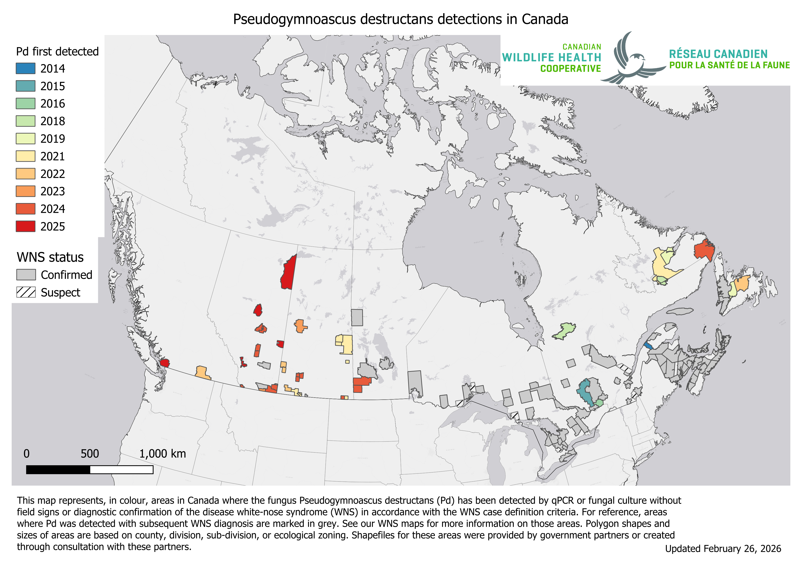
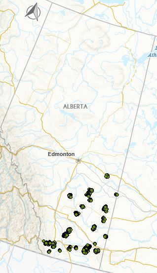

```{r}
#| label: Load packages and data
#| include: false
#| echo: false
#| eval: true
#| warning: false
#| message: false
 
library(tidyr)
library(dplyr)
library(lubridate)
library(stringr)
library(kableExtra)
library(tidyverse)
library(leaflet)
library(base64enc)
library(mapview)
library(sf)


```



# Land Acknowledgement

Biodiversity Pathways respectfully acknowledges that our work takes place on the territories of Treaties 6, 7, 8, and the Métis homeland, traditional and ancestral lands of First Nations and Métis Peoples, whose histories, languages, and cultures are directly linked to the biodiversity that we monitor.

We acknowledge the traditional teachings of the lands that we work on, and that reciprocal, meaningful, and respectful relationships with Indigenous peoples make our work possible. We are deeply grateful for their stewardship of these lands, and we are committed to supporting Indigenous-led monitoring programs, while learning Indigenous ways of knowing, being, and doing.

# Introduction

## Overview of NABat and the NNW Bat Hub

North American Bat Monitoring Program (NABat) is a large-scale coordinated effort to monitor bat species to address gaps in knowledge and lack of long-term studies across North America [@loeb2015Plan].The program is administered by the US Geological Survey (USGS) and implemented by the North by Northwest Bat (NNW) Hub in Alberta, British Columbia, and S.E Alaska.

NNW Bat Hub was established in 2024 with collaboration from Government of Alberta, Government of British Columbia, and Government of Alaska. The hub was formed by combining the previous Alberta Hub and the BC and southeast Alaska Hub. The implementation of the program within Alberta has key support from Parks Canada, government of Alberta staff, other wildlife biologists, Indigenous Nations, community members and naturalists across the province.

### NABat Monitoring in Banff National Park

Banff National Park has been conducting NABat monitoring in one NABat Grid cell (Grid Cell Id: 148842), which includes 3 long term monitoring sites and a driving transect since 2020.

## Threats to bat populations in Alberta

Bat populations in Alberta face a wide range of threats including forestry practices, anthropogenic expansion, and climate change among others. Of these threats, White-Nose Syndrome and wind energy development have emerged as two of the highest-priority concerns.

### White-Nose Syndrome

White-nose Syndrome (WNS) is a deadly fungal disease caused by the fungus *Pseudogymnoascus destructans* (*Pd*) that affects hibernating bats. As of 2026, WNS has been confirmed in nine Canadian provinces including Alberta ( @fig-WNS: @cwhc-rcsf2024Canadian). Since Pd was first confirmed in AB in 2022, the fungus and the ensuing disease have spread through the province at a rapid pase and has now been detected at the provinces largest known hibernacula, Cadamun cave (Wilkinson, pers. comm.) Continued monitoring of populations in AB is critical as *Pd* and WNS continue to spread throughout the province.

{#fig-WNS}

### Wind Energy Development

Wind energy farms has been linked to high mortality rates across all bat species in Canada, with long distance migratory species accounting for 73% of recorded fatalities [@zimmerling2016Bat]. In Alberta alone, one estimate predicts an annual mortality rate 10.9 bats per turbine [@zimmerling2016Bat]. There are currently 1,778 turbines active in the province across 49 different projects with the most turbines found in the grassland ecosystem (@NRCan2025Wind ; @fig-turbines). Using @zimmerling2016Bat estimate, we estimate that Alberta is loosing 19,380 bats per year to wind turbine collisions. As of 2023, COSEWIC designated all three of Alberta's long distance migratory species as endangered due in part to fatalities at wind turbine facilities [@committeeonthestatusofendangeredwildlifeincanada2023Hoary].

{#fig-turbines}

## Acoustic Monitoring of Bats

Acoustic recording is a cost-effective method for monitoring bat populations across large geographic and temporal scales. However, several limitations affect the conclusions that can be drawn from these data:

1.  **Imperfect species identification** — Unlike birds, bats rely on echolocation rather than song, and species with similar ecology and physiology often produce overlapping calls. While detectors are deployed to maximize recordings of diagnostic Search Phase calls, species identifiability will always vary depending on the local assemblage.

2.  **Variable detectability** — Bat species are not equally detectable acoustically. Larger, wide-ranging species produce louder calls that travel farther, while smaller species with quieter calls or specialized habitat use are less reliably recorded. As a result, trend estimates cannot be produced for all species using acoustic methods alone.

3.  **Data variability** — Many factors influence recording quality and bat activity, including wind speed, humidity, and local habitat. Additionally, stationary detectors cannot account for individual recapture, meaning acoustic data can only inform relative activity and occupancy.

4.  **Processing limitations** — Auto-ID software enables efficient processing of large datasets but has known high misclassification rates for bats, making manual verification necessary to ensure accurate results.

# Methods

Banff National Park has monitored one NABat grid cell using three sites and has collected acoustic data from 2020 to 2025. Recordings were processed using an automated classifier (Kaleidoscope's Bats of North America 5.4.0 classifier) to assign species identifications and exclude non-bat recordings.

Manual verification was only perfomed in 2024 and 2025. For the trends estimates only autoID results were included unless the manual verification results indicated that what was tagged as a bat was actually noise. We only included the autoID results for the trends to keep it consistent, since looking at the manually verified results for only the last two years would have made it difficult to interpret the results across the years.

## *Manual Verification of 2025 Data*

## *Data processing*

Species presence and nightly activity were calculated from a site-night-species table constructed for all sampled nights. Sampling effort was defined as each unique site-night with acoustic recordings. Species codes were standardized across data sources prior to analysis. Weather covariates were summarized for each sampling night and included mean temperature, mean relative humidity, total precipitation, and mean wind speed. Moon covariates were calculated for each site-night and included moon illumination, and an indicator of moon position. Mean nightly passes included all recordings with species or couplet labels, with couplets split and counted for both species. For trend analyses, MYLU, MYSE, and MYVO were pooled into a single Myotis group (40KMYO) - because we know that there is high degree of error in the autoID for these species. That being said most of the reocrdings are likely to be MYLU.

## *Statistical analysis*

Statistical trend analyses were conducted for EPFU, LABO, LACI, LANO, and 40KMYO. Models were fit to nightly detection counts using negative binomial generalized linear mixed models (GLMMs) with a log link. Sites were included as a random intercept. Candidate model structures included year, Julian date, quadratic Julian date, and species-specific covariates. Trend analyses are presented only for species confirmed to be present at the sites through manual verification and for which models fully converged.

# Results

Across the 2020--2025 monitoring period, a total of 35,103 bat detections were recorded across the three sites in the Banff NABat grid cell. The Myotis group (40KMYO) had the highest number of detections (29,209; mean = 111.00). This was followed by Hoary Bat (2,009; mean = 7.61), Silver-haired Bat (1,773; mean = 6.72), Big Brown Bat (1,355; mean = 5.13), and Eastern Red Bat (757; mean = 2.87).

::: {.content-visible when-format="html"}
## *Interactive map*
:::

## *Species detected and mean nightly activity*

Detected species and nightly bat activity varied among years and sites (Table 1). In total, up to eight species were detected, with Big Brown Bat (EPFU), Silver-haired Bat (LANO), Hoary Bat (LACI), and Eastern Red Bat (LABO) detected across most years and sites. Myotis species showed more variable detections: Little Brown Myotis (MYLU) was detected frequently, while Long-legged Myotis (MYEV), Western Long-eared Myotis (MYVO), and Long-eared Myotis (MYSE) were detected less consistently.

Nightly bat activity varied across quadrants and years. Activity was highest in NE and NW in 2022--2023, while SW remained consistently low. NW showed a pronounced peak in 2024, the highest across all years, whereas activity in 2025 was more uniform among quadrants. Overall, while several species were consistently detected across the study period, both species presence and nightly activity showed strong spatial and temporal variability. Differences in sampling effort among quadrants and years likely contributed to some level to this pattern.

```{r}
#| echo: false
#| eval: true
#| warning: false
#| message: false
#| include: true
#| tbl-cap: Monitoring effort and bat species detections in the Banff (2020–2025). Mean nightly recordings (± SD) represent total bat detections per night summed across species. Species detections indicate presence (X) within each year and quadrant based on combined automated and manually reviewed identifications.
#| label: tbl-sppmean


```

## *Species Trends*

Models converged for five species/groups: Big Brown Bat (EPFU), Eastern Red Bat (LABO), Hoary Bat (LACI), Silver-haired Bat (LANO), and the combined Myotis group (\@fig-trends). Significant increases in nightly activity were detected for Big Brown Bat (β = 0.74, SE = 0.09, z = 8.11, p \< 0.001) and Eastern Red Bat (β = 0.81, SE = 0.10, z = 7.88, p \< 0.001). In contrast, no significant temporal trend was detected for Hoary Bat (β = 0.10, SE = 0.09, z = 1.10, p = 0.270), Silver-haired Bat (β = 0.06, SE = 0.13, z = 0.48, p = 0.633), or the combined Myotis group (β = 0.22, SE = 0.12, z = 1.81, p = 0.071).

{#fig-trends}

# Discussion

Data used for trends only uses autoID from Kaleidoscope, which has been shown to confuse Myotis spp. for LABO.\
Results must be taken with caution because of small sample size, but overall can conclude that bat species at the grid cell are stable.

# Acknowledgements



# Literature Cited
